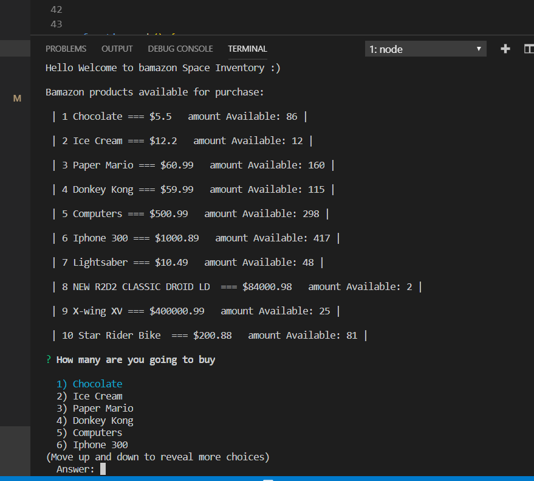
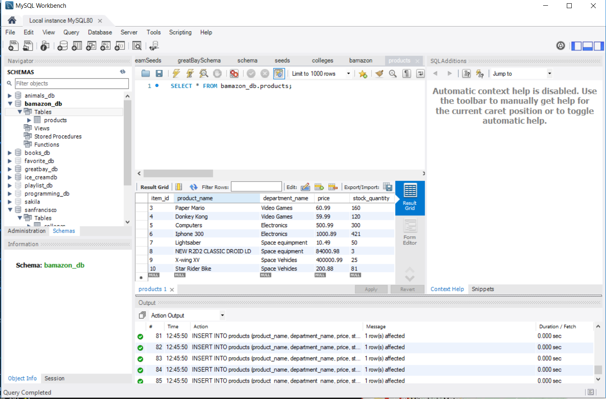
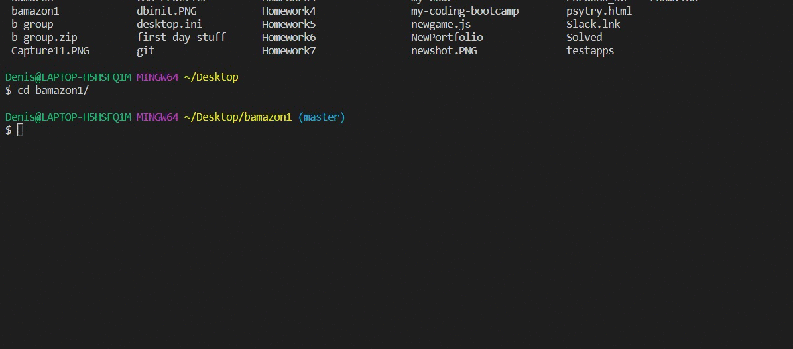

# bamazon
This is an example amazon like app that is made to show how to use sql and js to create a simple app that will ask the user how much of given items they want to purchase.

I manage to create a table using sql workbench to first see how my items would appear 

Then after that was done I added the code and I used inquirer to ask the user what item to buy and how many of that item to purchase.

After you make the purchase the amount should update.